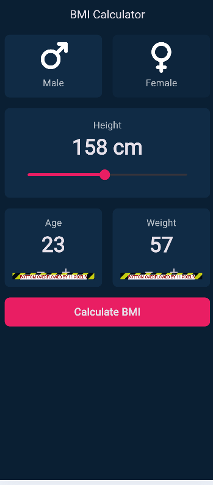
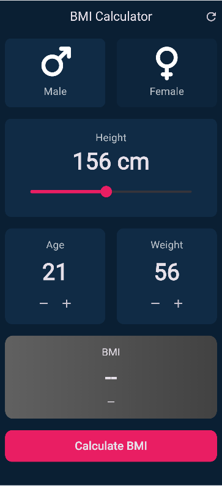
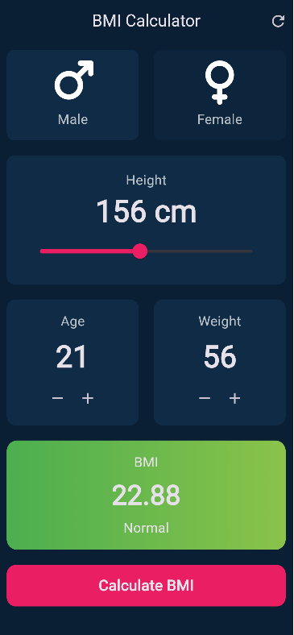
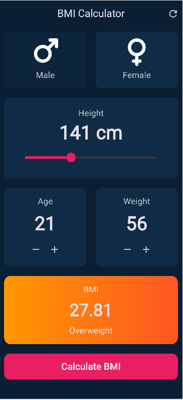

# 💪 BMI Calculator App (Flutter)

A modern and beautiful **BMI Calculator** built with **Flutter**, featuring smooth animations, gradient UI, gender selection using Mars & Venus icons, and real-time BMI calculation.

---

## ✨ Features

- 🚻 Gender selection (♂ Male / ♀ Female)
- 📏 Height selection using a **slider**
- ➕➖ Age & Weight control with increment/decrement buttons
- 🧮 Accurate **BMI calculation**
- 🎨 Gradient-based BMI result (changes with BMI category)
- 🎬 Smooth animations when BMI updates
- 🔄 Reset button to clear values
- 📱 Responsive & clean UI

---

## 📸 Screenshots

| Home Screen | Input Values | BMI Result |
|------------|-------------|------------|
|  |  |  | 


---

## 🛠️ Tech Stack

- **Flutter**
- **Dart**
- **Material UI**
- **Font Awesome Icons**

---

## 📂 Project Structure

```text
lib/
│── screens/
│   └── bmi_screen.dart
│
│── widgets/
│   ├── gender_card.dart
│   ├── height_slider.dart
│   ├── value_card.dart
│   └── bmi_result.dart
│
│── utils/
│   └── constants.dart
│
└── main.dart
